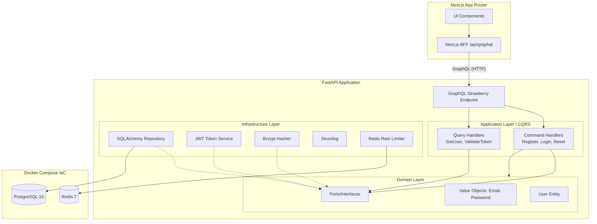

# Orbitto Auth - Advanced Engineer Challenge

Репозиторий содержит решение челленджа на позицию backend/fullstack инженера, реализованное по принципам **DDD, CQRS и IaC**. В качестве стека были выбраны **FastAPI (Python)** и **Next.js (React)**, взаимодействие между которыми построено на **GraphQL**. 

В проекте сформирована прозрачная история коммитов, демонстрирующая последовательный подход к разработке от инициализации инфраструктуры до финальной интеграции UI.

## Особенности реализации
- **Backend (FastAPI, Python 3.13 Ready):** Использован нативный модуль `bcrypt` для хэширования без устаревших зависимостей. Настроена строгая типизация доменных сущностей (Value Objects), валидирующих email и пароль прямиком в Domain Layer (DDD). GraphQL API построено на базе Strawberry, reset-token хранится в БД только в виде SHA-256 хэша, а секреты/URL-ы инфраструктуры вынесены в переменные окружения.
- **Frontend (Next.js, Apollo):** Реализован светлый UI на App Router. GraphQL-клиент ходит не напрямую в FastAPI, а через Next.js BFF-прокси `/api/graphql`, что позволяет хранить access token в `httpOnly` cookie вместо `localStorage`.
- **Инфраструктура:** Docker Compose поднимает PostgreSQL 15, Redis 7, backend и frontend. На backend включен rate limiting для auth/reset сценариев.

## Запуск проекта

**Требования:** Docker и Docker Compose (для БД и Redis), Node.js (для фронтенда), Python 3.10+ (для локального бэкенда при желании).

### Быстрый запуск с Docker Compose
```bash
# Поднять весь стек
docker-compose up --build
```

После запуска:
- Frontend будет доступен по адресу: `http://localhost:3000`
- Встроенный интерфейс GraphQL (Strawberry): `http://localhost:8000/graphql`

### Основные переменные окружения backend
- `APP_ENV`: `development`, `test` или `production`. По умолчанию `development`.
- `JWT_SECRET_KEY`: обязателен в `production`. В `development` и `test` используется стабильный dev-secret по умолчанию.
- `RATE_LIMIT_FAIL_OPEN`: опциональный override для поведения rate limiter при недоступном Redis.
- `CORS_ORIGINS`: CSV-список origin-ов для frontend.

### Локальный запуск без Docker
```bash
# Backend
cd backend
python3 -m venv .venv
source .venv/bin/activate
pip install -r requirements.txt
uvicorn src.main:app --reload --port 8000

# Frontend
cd frontend
npm install
npm run dev
```

### Тесты backend
```bash
cd backend
pip install -r requirements-dev.txt
python3 -m pytest
```

---

## Архитектурная схема (Mermaid)



---

## Как были реализованы принципы

### 1. Domain-driven Design (DDD)
- **Изоляция:** Слой `src/domain` не имеет зависимостей от фреймворков и БД.
- **Value Objects:** Введено строгую типизацию для `Email`, `RawPassword` и `HashedPassword` с проверками инвариантов на момент создания.
- **Rich User Entity:** Модель `User` инкапсулирует бизнес-правила генерации и валидации password reset состояния, запрещая внешним сервисам менять состояние напрямую: `user.request_password_reset()` и `user.reset_password()`.
- **Ports & Adapters:** Слой инфраструктуры имплементирует абстракции (порты), определенные в Application layer (`UserRepository`, `PasswordHasher`).

### 2. Command Query Responsibility Segregation (CQRS)
- **Read/Write разделение:** Логика разделена на команды (изменение состояния: регистрация, выдача токенов) и запросы (получение данных).
- **GraphQL:** Идеально ложится на эту парадигму (Mutations = Commands, Queries = Queries).
- **ReadModels:** Запросы возвращают специально подготовленные `UserReadModel`, минуя загрузку тяжелой бизнес-сущности `User`. В реальном проекте Read репозитории могут обращаться напрямую к реплике БД или кэшу.

### 3. Infrastructure as Code (IaC)
- Инфраструктура полностью описана в `docker-compose.yml`, который поднимает PostgreSQL с healthcheck-ами и Redis для rate-limiting.

---

## Ключевые компромиссы (Trade-offs / ADRs)

1. **GraphQL вместо gRPC:** gRPC крут для микросервисов, но GraphQL предоставляет лучшую эргономику для Next.js (через Apollo) при публичном API для браузера. CQRS-команды очень легко проецировать на GraphQL Mutations.
2. **Общий session factory для Command/Query путей:** Для упрощения проект использует общий `AsyncSessionLocal`, но read и write репозитории уже разведены по разным классам, чтобы не смешивать доменные и read-модели в одном контракте.
3. **Отсутствие асинхронной шины (Event Bus):** В "чистом" DDD после `user.request_password_reset()` публикуется доменное событие (Domain Event), а хендлер отправляет письмо через RabbitMQ/Kafka. Для простоты здесь это опущено, но заложен в архитектуру.
4. **BFF вместо прямого хранения токена в браузере:** Access token сохраняется в `httpOnly` cookie через Next.js route handler и проксируется в backend через `/api/graphql`. Это безопаснее `localStorage`, но делает frontend частью auth-контура.
5. **Rate limiting fail-open только вне production:** В `development` и `test` auth/reset endpoint-ы переживают недоступность Redis, но в `production` такая ситуация должна приводить к `503`, а не к тихому отключению ограничения.

---

## Следующие шаги для Production-версии

- [ ] **IaC Evolution:** Переписать развёртывание на Terraform + Helm Charts для Kubernetes (ingress, cert-manager).
- [ ] **Refresh Tokens:** Добавить refresh-token flow и ротацию сессий вместо одного short-lived access token.
- [ ] **Event-Driven Broker:** Внедрить RabbitMQ / Kafka или хотя бы Celery/Redis Queue для обработки Domain Events (рассылка писем, аналитика регистраций).
- [ ] **Миграции БД:** Добавить Alembic для контроля версионирования схемы БД.
- [ ] **Outbox Pattern:** Добавить паттерн Transactional Outbox для синхронизации транзакций БД с публикацией событий.
