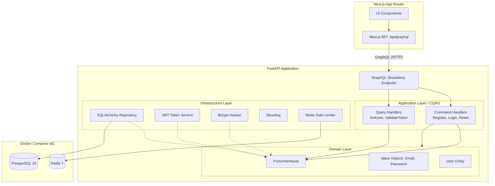

# Orbitto Auth - Advanced Engineer Challenge

Репозиторий содержит решение челленджа на позицию backend/fullstack инженера, реализованное по принципам **DDD, CQRS и IaC**. В качестве стека были выбраны **FastAPI (Python)** и **Next.js (React)**, взаимодействие между которыми построено на **GraphQL**. 

В проекте сформирована прозрачная история коммитов, демонстрирующая последовательный подход к разработке от инициализации инфраструктуры до финальной интеграции UI.

## Почему именно этот стек

### Почему `Python + FastAPI`
- Для challenge-формата важна скорость итерации без потери архитектурной ясности. Python позволяет быстро двигаться по доменной модели, не тратя большую часть времени на бойлерплейт.
- `FastAPI` хорошо сочетается с layered architecture: домен остается независимым, а transport/infrastructure остаются тонкими адаптерами.
- Нативный async-стек хорошо покрывает GraphQL, PostgreSQL, Redis и фонового outbox-dispatcher без отдельной технологической зоопарковости.
- По сравнению с более “тяжелыми” backend-фреймворками здесь меньше incidental complexity для узкого auth-модуля.

### Почему `Next.js`
- Клиентская часть уже задана UI-макетом, поэтому нужен был практичный browser-first стек с хорошей server/client интеграцией.
- App Router и route handlers естественно позволяют построить BFF-слой, хранить access token в `httpOnly` cookie и делать server-side route guard.
- Это дает более сильный auth-контур, чем прямой browser-to-backend GraphQL с токеном в `localStorage`.

### Почему `GraphQL`, а не REST и не gRPC
- `GraphQL` здесь естественно мапится на CQRS: `mutations` как command side, `queries` как query side.
- Для браузерного клиента и challenge-формата GraphQL эргономичнее gRPC: меньше транспортного трения, лучше fit для Apollo/Next.js.
- REST в этом челлендже дал бы более слабый инженерный сигнал, потому что решение слишком легко скатывается в stock controller-based auth API.

### Какие альтернативы рассматривались
- **`Go + gRPC`**: сильнее по transport rigor и внутренним сервисным контрактам, но ощутимо тяжелее для browser-first challenge, где важна не только backend строгость, но и полный auth flow с UI.
- **`NestJS + REST`**: быстро реализуемо, но в рамках этого задания хуже показывает DDD/CQRS и легче превращается в conventional controller/service auth without strong domain boundaries.
- **Готовый auth-провайдер**: сознательно не использован, потому что он скрывает главную часть челленджа, а именно собственные доменные и архитектурные решения.

## Особенности реализации
- **Backend (FastAPI, Python 3.13 Ready):** Использован нативный модуль `bcrypt` для хэширования без устаревших зависимостей. Настроена строгая типизация доменных сущностей (Value Objects), валидирующих email и пароль прямиком в Domain Layer (DDD). GraphQL API построено на базе Strawberry, reset-token хранится в БД только в виде SHA-256 хэша, а доставка reset-link идет через DB-backed outbox + background dispatcher.
- **Frontend (Next.js, Apollo):** Реализован светлый UI на App Router. GraphQL-клиент ходит не напрямую в FastAPI, а через Next.js BFF-прокси `/api/graphql`, что позволяет хранить access token в `httpOnly` cookie вместо `localStorage`.
- **Инфраструктура:** Docker Compose поднимает PostgreSQL 15, Redis 7, backend и frontend. На backend включен rate limiting для auth/reset сценариев, а схема БД управляется через Alembic migrations.

## Запуск проекта

**Требования:** Docker и Docker Compose (для БД и Redis), Node.js (для фронтенда), Python 3.10+ (для локального бэкенда при желании).

### Быстрый запуск с Docker Compose
```bash
# Поднять весь стек
docker-compose up --build
```

После запуска:
- Frontend будет доступен по адресу: `http://localhost:3000`
- Встроенный интерфейс GraphQL (Strawberry): `http://localhost:8000/graphql`

### Основные переменные окружения backend
- `APP_ENV`: `development`, `test` или `production`. По умолчанию `development`.
- `APP_BASE_URL`: базовый URL frontend-приложения для формирования reset-link preview.
- `JWT_SECRET_KEY`: обязателен в `production`. В `development` и `test` используется стабильный dev-secret по умолчанию.
- `RATE_LIMIT_FAIL_OPEN`: опциональный override для поведения rate limiter при недоступном Redis.
- `CORS_ORIGINS`: CSV-список origin-ов для frontend.
- `SMTP_HOST`, `SMTP_PORT`, `SMTP_USERNAME`, `SMTP_PASSWORD`, `SMTP_FROM_EMAIL`, `SMTP_USE_TLS`: используются для production delivery adapter при отправке reset-link по email.

### Локальный запуск без Docker
```bash
# Backend
cd backend
python3 -m venv .venv
source .venv/bin/activate
pip install -r requirements.txt -r requirements-dev.txt
alembic upgrade head
uvicorn src.main:app --reload --port 8000

# Frontend
cd frontend
npm install
npm run dev
```

### Тесты backend
```bash
cd backend
python3 -m venv .venv
source .venv/bin/activate
pip install -r requirements.txt -r requirements-dev.txt
alembic upgrade head
PYTHONPATH=. python3 -m unittest discover -s tests -p 'test_*.py'
```

---

## Архитектурная схема (Mermaid)



---

## Как были реализованы принципы

### 1. Domain-driven Design (DDD)
- **Изоляция:** Слой `src/domain` не имеет зависимостей от фреймворков и БД.
- **Value Objects:** Введено строгую типизацию для `Email`, `RawPassword` и `HashedPassword` с проверками инвариантов на момент создания.
- **Rich User Entity:** Модель `User` инкапсулирует бизнес-правила генерации и валидации password reset состояния, запрещая внешним сервисам менять состояние напрямую: `user.request_password_reset()` и `user.reset_password()`.
- **Ports & Adapters:** Слой инфраструктуры имплементирует абстракции (порты), определенные в Application layer (`UserRepository`, `PasswordHasher`).
- **Bounded Contexts:** Явные границы контекстов вынесены в [docs/architecture/bounded-contexts.md](/Users/aiezq/python_pr/engineer-challenge/docs/architecture/bounded-contexts.md).

### 2. Command Query Responsibility Segregation (CQRS)
- **Read/Write разделение:** Логика разделена на команды (изменение состояния: регистрация, выдача токенов) и запросы (получение данных).
- **GraphQL:** Идеально ложится на эту парадигму (Mutations = Commands, Queries = Queries).
- **ReadModels:** Запросы возвращают специально подготовленные `UserReadModel`, минуя загрузку тяжелой бизнес-сущности `User`. В реальном проекте Read репозитории могут обращаться напрямую к реплике БД или кэшу.

### 3. Infrastructure as Code (IaC)
- Инфраструктура полностью описана в `docker-compose.yml`, который поднимает PostgreSQL с healthcheck-ами и Redis для rate-limiting.
- Docker image backend при старте выполняет migration bootstrap через Alembic: на пустой БД применяется `upgrade head`, на legacy volume без `alembic_version` выполняется совместимое `stamp + upgrade`, поэтому schema evolution не зависит от `metadata.create_all()`.

### Ключевые инварианты и бизнес-правила
- Email нормализуется и валидируется в Domain Layer.
- Пароль обязан удовлетворять policy: минимум 12 символов, uppercase, lowercase, digit, без пробелов по краям.
- Reset token хранится только в hashed-виде, имеет срок жизни и инвалидируется после успешного reset.
- `register`, `authenticate`, `requestPasswordReset`, `resetPassword` и `validateResetToken` ограничены rate limiting.
- В `development/test` password reset flow demo-friendly: backend возвращает preview reset-link, в `production` этот preview отключен.
- Password reset delivery не выполняется в HTTP request thread: mutation пишет событие в outbox, а отдельный dispatcher забирает его и отправляет через configured delivery adapter.

### Observability
- В приложении подключен structured JSON logging через `structlog`.
- Добавлен HTTP middleware, логирующий `request_id`, путь, метод, статус и длительность запроса.
- Auth-события логируются как отдельные доменные события (`user_registered`, `authentication_succeeded`, `password_reset_requested`, `password_reset_completed`), а outbox delivery логируется отдельно как success/failure path.

### Event-Driven Delivery
- Password reset mutation создает `PasswordResetRequested` event и сохраняет его в таблицу outbox в той же транзакции, что и reset-token state.
- Background dispatcher периодически резервирует pending messages, вызывает delivery adapter и помечает сообщение delivered/failed с retry semantics.
- В `development/test` используется logging delivery adapter, в `production` при наличии SMTP-конфигурации используется SMTP adapter.

### Backward Compatibility
- Публичный GraphQL-контракт auth flow не ломался: `requestPasswordReset` сохраняет shape ответа (`ok`, `deliveryMode`, `resetUrlPreview`).
- Для БД введен compatibility window между legacy `reset_token` и новым `reset_token_hash`: репозиторий читает новый столбец и умеет fallback-иться на legacy данные.
- Alembic migration backfill-ит старые `reset_token` значения в `reset_token_hash`, а новые записи уже пишутся только в новый столбец.
- Outbox events versioned через `event_type + event_version`, что дает контролируемую эволюцию payload schema.

---

## Ключевые компромиссы (Trade-offs / ADRs)

1. **GraphQL вместо gRPC:** gRPC крут для микросервисов, но GraphQL предоставляет лучшую эргономику для Next.js (через Apollo) при публичном API для браузера. CQRS-команды очень легко проецировать на GraphQL Mutations.
2. **Общий session factory для Command/Query путей:** Для упрощения проект использует общий `AsyncSessionLocal`, но read и write репозитории уже разведены по разным классам, чтобы не смешивать доменные и read-модели в одном контракте.
3. **DB-backed outbox вместо внешнего брокера:** Для challenge достаточно in-process dispatcher + outbox table. Это дает event-driven delivery и transactional safety без отдельной инфраструктуры RabbitMQ/Kafka.
4. **BFF вместо прямого хранения токена в браузере:** Access token сохраняется в `httpOnly` cookie через Next.js route handler и проксируется в backend через `/api/graphql`. Это безопаснее `localStorage`, но делает frontend частью auth-контура.
5. **Rate limiting fail-open только вне production:** В `development` и `test` auth/reset endpoint-ы переживают недоступность Redis, но в `production` такая ситуация должна приводить к `503`, а не к тихому отключению ограничения.
6. **Alembic вместо implicit `create_all()`:** Это добавляет шаг миграций в dev/prod bootstrap, но дает контролируемую эволюцию схемы и явную backward-compatibility story.

Отдельные ADR:
- [docs/adr/0001-graphql-over-grpc.md](/Users/aiezq/python_pr/engineer-challenge/docs/adr/0001-graphql-over-grpc.md)
- [docs/adr/0002-bff-cookie-auth.md](/Users/aiezq/python_pr/engineer-challenge/docs/adr/0002-bff-cookie-auth.md)

## Moodboard Materials
- [docs/moodboard.md](/Users/aiezq/python_pr/engineer-challenge/docs/moodboard.md)
- [docs/anti-moodboard.md](/Users/aiezq/python_pr/engineer-challenge/docs/anti-moodboard.md)

---

## Следующие шаги для Production-версии

- [ ] **IaC Evolution:** Переписать развёртывание на Terraform + Helm Charts для Kubernetes (ingress, cert-manager).
- [ ] **Refresh Tokens:** Добавить refresh-token flow и ротацию сессий вместо одного short-lived access token.
- [ ] **External Event Bus:** Вынести in-process outbox dispatcher во внешний брокер или worker-pool для независимого масштабирования доставки и ретраев.
- [ ] **Schema Governance:** Добавить более жесткую политику data migrations: expand/contract rollout, automated downgrade smoke checks и compatibility gates в CI.
- [ ] **Delivery Reliability:** Добавить delivery dead-letter queue, provider failover и webhook-based observability для email-событий.
